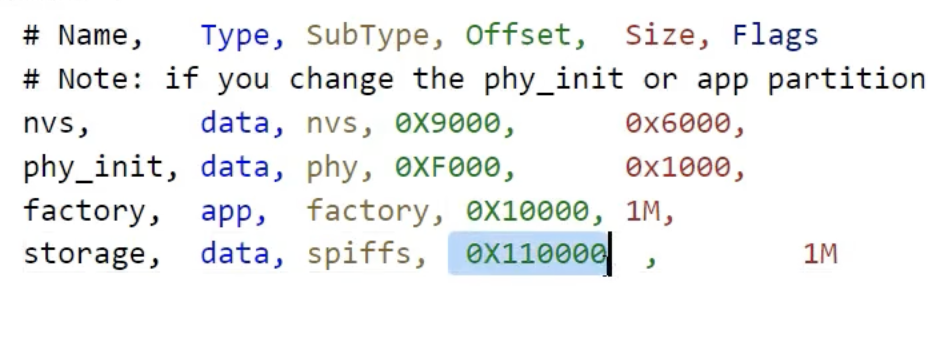

# important
- When returning to this for revision, ignore all the other files & folders but for your partitions.csv, your main folders' subfolders, and main/CMakeFile.txt. Choose a type of storage, read the summary below, and follow the code; notes made therein will contextualise the relevant additional scripts and folders.

# SPIFFS
- SPI FLASH FILE SYSTEM
- Flash an entire directory into flash
- You can use common c file functions to create read update delete files
- Size is configured in the partition table

SPIFFS is a virtual file system and doesn't support an actual directory structure; you can use the file name to act like a path.  
Pay attention to your main/CMakeLists.txt.  
The python scripts in the relative-root here are used for the uploadOrAlterFiles() function in SPIFFS.c:  
- spiffsgen.py can take a directory and create a .bin file out of it:
`spiffsgen.py image size  base dir  output file`. In our case, we've set 1MB of space in our partitions CSV, and our base dir is in the relative-root. So: `spiffsgen.py 0x100000 spiffs_dir spiffs_dir.bin`
- esptool.py can then take that .bin file and pass it into flash memory.

### commands
##### To generate a bin file 
`spiffsgen.py <size> <folder> <out bin file>`
```
spiffsgen.py 0x100000 folder_to_download to_flash.bin 
```
##### to flash
`esptool.py --chip esp32 --port <port> --baud 115200 write_flash -z <start address> <the bin file>`
```
esptool.py --chip esp32 --port COM5 --baud 115200 write_flash -z 0x110000 to_flash.bin
```
Note the start address param specifying the beginning address of your SPIFF partition: you need to go through your addresses in your partitions.csv, adding red from line a to green from line a to get green for line a+1, starting at the default memory address of 0x9000. Use a hex calculator.  


If you have problems, go to: https://learnesp32.com/videos/storage/spiffs-loading-data-scripts


# NVS
Non-volatile storage holds Key:Val pairs, so you're using fairly bog-standard getter/setter functions, many of which you can wrap in error checks like below, because they all return error types.  
Pay attention to your main/component.mk.


### Partitioning
NVS can be partitioned, meaning your FLASH memory can be custom-apportioned for your project needs.  
`components -> partition_table -> CSV files`  
Then append the .csv with an additional partition. Then, to set it on the chip,:  
``` 
idf.py menuconfig
  Partition Table
    1st setting: Partition Table (etcetc)
      Custom CSV
  Serial Flasher Config
    Flash Size
      4MB or whatever you need
```


### COMPILATION
```
idf.py erase_flash flash monitor
```